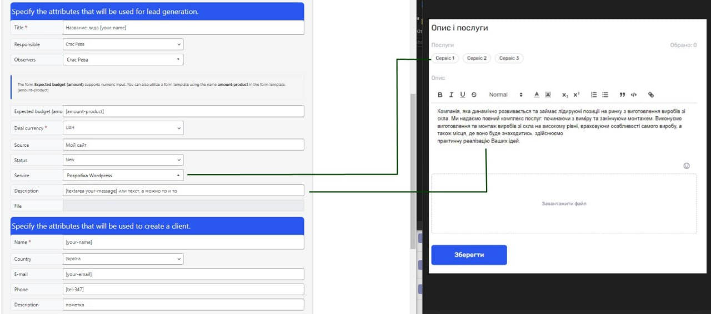

### Плагін для інтеграції контактної форми з сервісом If.team
Плагін працює як із плагіном **Contact Form 7**, так і з кастомними формами CMS WordPress

## Встановлення:
Щоб використовувати плагін, вам необхідно його завантажити та встановити. Дивіться директорію [build](build).
Встановлення через WP-панель /wp-admin/plugin-install.php за допомогою кнопки Завантажити плагін, або через FTP.
Після встановлення й активації плагіна у вкладці Contact Form 7 з’явиться новий розділ CF7 Lead Generation.

## Налаштування плагіна: 
 1. Отримайте ApiKey у сервісі If.team або через техпідтримку.
 2. Перейдіть у налаштування плагіна Contact Form 7 -> CF7 Lead Generation -> Налаштування cf7lg.
 3. Вкажіть ключ і збережіть його.
 
## Налаштування форми:
 1. Перейдіть у Contact Form 7 -> Контактні форми -> Генерація лідів.
 2. Переконайтеся, що немає повідомлення про неправильний ApiKey.

| Позначення                                          | Опис                                                                         |
| :-------------------------------------------------- | :--------------------------------------------------------------------------- |
| Назва ліда (Title)                                  | Заголовок ліда. Підтримує CF7 тег                                            |
| Відповідальний (Responsible)                        | Список відповідальних за лід                                                 |
| Учасники (Observers)                                | Список учасників, які братимуть участь у проєкті                             |
| Очікуваний бюджет (сума) (Expected budget (amount)) | Використовуємо тільки число. Підтримує CF7 тег \[amount-product]             |
| Валюта (Deal currency)                              | Валюта, з якою хочемо працювати. Обов’язковий параметр                       |
| Джерело (Source)                                    | Додаткова інформація, звідки прийшов лід                                     |
| Статус (Status)                                     | Статус ліда. Дані надходять із сервера If.team                               |
| Сервіс (Service)                                    | Послуга, до якої ви хочете прив’язати лід. Дані надходять із сервера If.team |
| Опис (Description)                                  | Опис ліда. Підтримує CF7 тег                                                 |
| Повне ім’я (Full Name)                              | Обов’язкове поле. Підтримує CF7 тег                                          |
| Країна (Country)                                    | Вибір країни                                                                 |
| E-mail                                              | Дані, які вказав користувач у формі. Підтримує CF7 тег                       |
| Телефон (Phone)                                     | Дані, які вказав користувач у формі. Підтримує CF7 тег                       |
| Опис (Description)                                  | Дані, які вказав користувач у формі. Підтримує CF7 тег                       |


<div style="display: flex; gap: 10px;">
    
    
</div>

## Підтримка UTM-міток
За замовчуванням, якщо вони є, ми їх передаємо, але ви можете передавати власні. Для цього потрібно активувати чекбокс і вказати свої мітки.

## Инші форми WP
Якщо ви хочете використовувати плагін із кастомними формами, вам потрібно інтегрувати вашу форму з нашим плагіном:
Ось приклад, як це можна реалізувати з мінімальними вимогами if.team для генерації лідів:

```php
add_action( 'wp_ajax_send_mail', 'send_mail_callback' );
add_action( 'wp_ajax_nopriv_send_mail', 'send_mail_callback' );

function send_mail_callback() {
    $response = array(
        'status'    => 'failed',
        'messages'  => __( 'Mail sending error.', 'ifteam' ),
        'data'      => null
    );

    $params = array();
    parse_str( $_POST['dataForm'], $params );

    $name 		= isset( $params['name'] ) ? $params['name'] : '';
    $phone 		= isset( $params['phone'] ) ? $params['phone'] : '';
    $email 		= isset( $params['email'] ) ? $params['email'] : '';
    $comment 	= isset( $params['comment'] ) ? $params['comment'] : '';

    $utm = [
        'utm_source',
        'utm_medium',
        'utm_campaign',
        'utm_content',
        'utm_term',
    ];
    if( $name || $phone || $email ) {

        add_filter( 'wp_mail_content_type', 'set_html_content_type' );

        $headers = array(
            'From: if.team <noreply@ifteam.pro>',
            'content-type: text/html',
        );

        $to = 'info@ifteam.pro';
        $subject = __( 'Request from if.team website', 'ifteam' );

        $message = '';
        $url = wp_get_referer();
        $query = parse_url($url)['query'] ?? '';
        parse_str($query, $query_parse);

        if( $name ) {
        	$message .= '<p><b>ФИО</b>: ' . $name . '</p>';	
        }
        if( $phone ) {
        	$message .= '<p><b>Телефон</b>: ' . $phone . '</p>';	
        }
        if( $email ) {
        	$message .= '<p><b>Email</b>: ' . $email . '</p>';	
        }
        if( $comment ) {
        	$message .= '<p><b>Комментарий</b>: ' . $comment . '</p>';	
        }
        if (isset($_SERVER['REMOTE_ADDR']) && $_SERVER['REMOTE_ADDR'] != '') {
            $message .= '<p><b>IP</b>: ' . $_SERVER['REMOTE_ADDR'] . '</p>';
        }
        $message .= '<p><b>URL</b>: ' . $url . '</p>';

        foreach ($utm as $u) {
            if (!empty($query_parse)) {
                $message .= '<p><b>' . $u . '</b>: ' . $query_parse[$u] . '</p>';
            } elseif (isset($_COOKIE[$u]) && $_COOKIE[$u] != '') {
                $message .= '<p><b>' . $u . '</b>: ' . $_COOKIE[$u] . '</p>';
            }
        }

        if( wp_mail( $to, $subject, $message, $headers ) ) {

        	$client = array(
        		'country_id'   => 235,
        	);

        	if(! empty( $name ) ) {
        		$client["name"] = $name;
        	}else{
        		$client["name"] =  $email;
        	}
        	if(! empty( $phone ) ) {
        		$client["phone"] = $phone;
        	}
        	if(! empty( $email ) ) {
        		$client["email"] = $email;
        	}

        	$data = array(
                    'client' => $client,
                    'name'=> 'Заявка із сайту If.team',
                    'currency_id'   => 1,
                    'responsible_id' => 7,
                    'status_id' => 2,
                    'source' => $url,
                    'date' => date("Y-m-d"),
                );

        	if( $comment ) {
        		$data["description"] = $comment;
        	}

        	// Добавляем UTM параметры, если они присутствуют в запросе или куки
			if (!empty($query_parse['utm_source']) || !empty($params['utm_source_cf7lg'])) {
			    if (!empty($query_parse['utm_source'])) {
			        $data['utm_source'] = $query_parse['utm_source'];
			    } elseif (!empty($params['utm_source_cf7lg'])) {
			        $data['utm_source'] = $params['utm_source_cf7lg'];
			    }
			}

			if (!empty($query_parse['utm_medium']) || !empty($params['utm_medium_cf7lg'])) {
			    if (!empty($query_parse['utm_medium'])) {
			        $data['utm_medium'] = $query_parse['utm_medium'];
			    } elseif (!empty($params['utm_medium_cf7lg'])) {
			        $data['utm_medium'] = $params['utm_medium_cf7lg'];
			    }
			}

			if (!empty($query_parse['utm_campaign']) || !empty($params['utm_campaign_cf7lg'])) {
			    if (!empty($query_parse['utm_campaign'])) {
			        $data['utm_campaign'] = $query_parse['utm_campaign'];
			    } elseif (!empty($params['utm_campaign_cf7lg'])) {
			        $data['utm_campaign'] = $params['utm_campaign_cf7lg'];
			    }
			}

			if (!empty($query_parse['utm_content']) || !empty($params['utm_content_cf7lg'])) {
			    if (!empty($query_parse['utm_content'])) {
			        $data['utm_content'] = $query_parse['utm_content'];
			    } elseif (!empty($params['utm_content_cf7lg'])) {
			        $data['utm_content'] = $params['utm_content_cf7lg'];
			    }
			}

			if ($query_parse['utm_term'] !== null && $query_parse['utm_term'] !== '') {
			    $data['utm_term'] = $query_parse['utm_term'];
			} elseif ($params['utm_content_cf7lg'] !== null && $params['utm_content_cf7lg'] !== '') {
			    $data['utm_term'] = $params['utm_term_cf7lg'];
			}

        	cleateLead($data);

            $response = array(
                'status'    => 'success',
                'messages'  => __( 'Thank you for reaching out, we will definitely contact you shortly!', 'if.team' ),
                'data'      => $params
            );

        }

        remove_filter( 'wp_mail_content_type', 'set_html_content_type' );

    }

    wp_die();
}
```

Якщо щось незрозуміло, ви завжди можете звернутися до техпідтримки [if.team](https://if.team).
